# 🧠 Physics-based Dynamic Learning for IEEE-39 Triphasic System

## ⚡ Goal

Develop a hybrid modeling framework for the IEEE-39 multi-phase power system, where a purely mathematical static model (loadflow-based) is progressively refined into a dynamic predictive model through data-driven corrections learned by **Kolmogorov–Arnold Networks (KANs)**.

---

## 🧩 1. Concept Overview

| Layer | Description | Output |
|-------|-------------|--------|
| **Physical base model** | Deterministic equations (admittance, KCL/KVL, loadflow) | $V_{\text{phys}}, I_{\text{phys}}$ |
| **Residual learner (KAN)** | Learns difference between physical model and measured/simulated reality | $r = V_{\text{obs}} - V_{\text{phys}}$ |
| **Hybrid model** | Combines both to produce faithful dynamic predictions | $\hat{V}(t) = V_{\text{phys}}(t) + \Delta V_{\text{KAN}}(t)$ |

### Philosophy:
> 🧮 **Start from exact math, then use KANs only to correct where physics diverges from reality.**

---

## 🧱 2. Current Data Foundation

**Source:** `Graph_model.h5`

Contains the static physics of the IEEE-39 system:

| Group | Content |
|-------|---------|
| `/topology` | Bus and branch connectivity (from/to indices) |
| `/phases/phase_[a,b,c]/edges` | $R_{\text{pu}}, X_{\text{pu}}, B_{\text{shunt}}$ per line |
| `/phases/phase_[a,b,c]/nodes` | $P, Q, V_{\text{pu}}$ per bus/phase |
| `/steady_state/power_flow_results` | $V_{\text{phys}}$, angles, P/Q results from loadflow |
| `/dynamic_models` | Optional machine/governor constants |
| `/initial_conditions` | Generator field voltages, initial state |
| `/metadata` | General info (source, units, etc.) |

🔸 **Missing for now:** zone or cluster labels (to be imported from spectral clustering).

---

## 🧮 3. Pipeline Overview

### **STEP 1 — Static model reconstruction**

- Rebuild per-phase admittance matrices $Y^{(a,b,c)}$ from $R, X, B$
- Compute Laplacians $L^{(a,b,c)}$ and Green kernels $K^{(a,b,c)} = (L + \mu I)^{-1}$
- Combine into averaged kernel $K = \frac{1}{3}\sum_{\phi} K^{(\phi)}$

📘 **Implemented in:** `Notebook_Landmarks_KAN_Pipeline_3phase.ipynb`

---

### **STEP 2 — Landmark selection (Learnable objects)**

- Select **12 representative buses** ("landmarks") using pivoted-Cholesky on $K$
- These buses act as the **KAN learnable objects**
- Compute Nyström interpolation weights:

$$W = K_{UR} K_{RR}^{-1}$$

to propagate local residuals to the entire grid

📂 **Outputs:**
- `selected_landmarks_12_3phase.csv`
- `interpolation_weights_3phase.csv`

🧠 **Interpretation:**  
Each KAN learns local dynamics for its bus; the rest of the network is reconstructed via $W$.

---

### **STEP 3 — (Optional) Zone integration**

- Import spectral clustering labels (zones) from previous analyses  
  → either via `zones.csv` or direct H5 injection (`/metadata/zones`)
- Apply quotas per zone for balanced landmark selection (e.g. 4 per zone)
- Add 1-swap refinement to optimize observability intra-zone

📘 **To-do:** integrate `zones.csv` or inject zones into H5.

---

### **STEP 4 — Static → Dynamic transition**

1. Retrieve dynamic voltage data or RMS simulations ($V_{\text{obs}}(t)$).
2. Compute residuals:

$$r_i(t) = V_i^{\text{obs}}(t) - V_i^{\text{phys}}$$

3. Train KAN per landmark bus to predict residuals from local features:

$$[P_i, Q_i, V_i^{\text{phys}}, P_{\text{neigh}}, Q_{\text{neigh}}, \ldots] \rightarrow r_i$$

4. Combine KAN outputs:

$$\hat{r}_U = W \, \hat{r}_R, \quad \hat{V} = V_{\text{phys}} + \hat{r}$$

🎯 **Result:** hybrid physics-KAN model capable of dynamic voltage prediction.

---

### **STEP 5 — Multi-scenario batch processing**

- Run the entire pipeline on all PowerFactory exports (`*.h5`)
- Aggregate results to evaluate:
  - Zone stability across perturbations
  - Landmark robustness
  - Predictive accuracy of KAN residuals

📘 **Future module:** `STEP3_batch_dynamic_KAN.ipynb`

---

## 🧠 4. Technical Stack

| Domain | Libraries |
|--------|-----------|
| **Numerical Core** | `numpy`, `scipy`, `h5py`, `pandas` |
| **Power System Math** | custom admittance builder + Laplacian kernels |
| **Learning** | `torch` or `jax` (for KAN implementation) |
| **Visualization** | `matplotlib`, `networkx`, `plotly` |
| **File format** | PowerFactory → `.h5` (as defined in `h5_format_specification.yaml`) |

---

## 📊 5. Folder Structure

```
📁 project_root/
├── data/
│   ├── Graph_model.h5
│   ├── h5_format_specification.yaml
│   ├── zones.csv                 # (optional)
│   └── ...
├── notebooks/
│   ├── 6-h5reading.ipynb
│   ├── 7-Selectionbus.ipynb
│   ├── Notebook_Landmarks_KAN_Pipeline.ipynb
│   └── Notebook_Landmarks_KAN_Pipeline_3phase.ipynb
├── scripts/
│   ├── inject_zones_to_h5.py     # (to be added)
│   └── build_zoned_graph.py
├── results/
│   ├── selected_landmarks_12_3phase.csv
│   ├── interpolation_weights_3phase.csv
│   └── proxy_metrics.csv
└── README.md
```

---

## 🔜 6. Next Steps Checklist

| Stage | Description | Status |
|-------|-------------|--------|
| Physical model import (.h5) | Loadflow data available | ✅ |
| Ybus reconstruction (3-phase) | Implemented | ✅ |
| Kernel & Laplacian builder | Implemented | ✅ |
| Landmark selection | Implemented | ✅ |
| Nyström weights export | Implemented | ✅ |
| Zone integration | Read from CSV or H5 | 🟡 (to add) |
| KAN local learners | Replace DummyKAN by real model | 🟡 (to add) |
| Proxy evaluation | Active (if V_obs available) | ✅ |
| Batch multi-scenario loop | Future work | 🚧 |
| Dynamic training data | From PowerFactory RMS simulations | 🚧 |

---

## 🧭 7. Philosophy of the Approach

### 1. **Mathematical foundation first**
Build a complete static model $f_{\text{phys}}$ of the system (no learning).

### 2. **Residual learning, not black-box ML**
KANs act only on discrepancies:

$$f_{\text{KAN}} \approx f_{\text{obs}} - f_{\text{phys}}$$

### 3. **Topology-aware generalization**
Leverage the physical graph structure (via $K$ and $W$) to propagate knowledge.

### 4. **Dynamic refinement**
Gradually extend from static residuals → dynamic corrections (time-dependent $r_i(t)$).

### 5. **Interpretable learning**
Every KAN correction has a physical meaning (local mismatch in impedance, load, or coupling).

---

## 📈 Visual Pipeline Summary

```mermaid
graph LR
    A[Physics Model<br/>Admittance + Loadflow] --> B[Kernel K<br/>Green's Function]
    B --> C[Landmark Selection<br/>12 buses via Cholesky]
    C --> D[KAN Training<br/>Local Residual Learning]
    D --> E[Dynamic Prediction<br/>V̂ = Vphys + ΔVKAN]
    
    style A fill:#e1f5ff
    style B fill:#fff4e1
    style C fill:#ffe1f5
    style D fill:#f5e1ff
    style E fill:#e1ffe1
```



---

## 📄 License

This project is part of ongoing research in hybrid physics-ML modeling for power systems.

---

## 🤝 Contributing

Contributions are welcome! Please feel free to submit a Pull Request.

---

## 📧 Contact

For questions or collaborations, please open an issue or contact the project maintainers.
